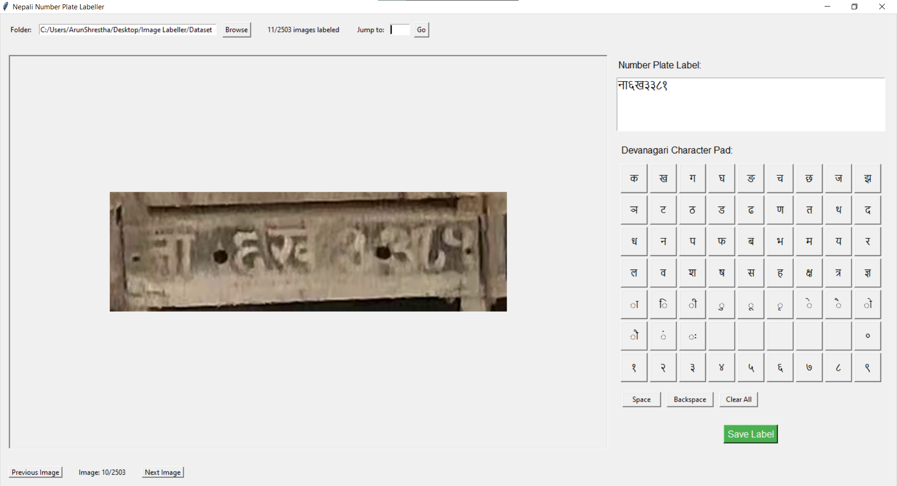

# Nepali Number Plate Labeling Tool

A specialized image labeling tool designed for annotating Nepali license plates with Devanagari characters. The tool provides an intuitive interface with a built-in Devanagari virtual keyboard to make the labeling process efficient and user-friendly.



## Features

- **Image Display & Navigation**
  - View images in a resizable viewing area
  - Navigate through images using buttons or keyboard shortcuts
  - Jump directly to any image by number
  - Track labeling progress with a counter

- **Devanagari Input System**
  - Virtual keyboard with all Devanagari characters commonly found on Nepali plates
  - Includes characters: 
  
            # Consonants (व्यंजन)

            "क", "ख", "ग", "घ", "ङ",
            "च", "छ", "ज", "झ", "ञ",
            "ट", "ठ", "ड", "ढ", "ण",
            "त", "थ", "द", "ध", "न",
            "प", "फ", "ब", "भ", "म",
            "य", "र", "ल", "व",
            "श", "ष", "स", "ह",
            "क्ष", "त्र", "ज्ञ",

            # Vowel Signs (मात्रा)
            "ा", "ि", "ी", "ु", "ू", "ृ", "े", "ै", "ो", "ौ", "ं", "ः", '', '', '', '', '',

            # Numbers (अंक)
            "०", "१", "२", "३", "४", "५", "६", "७", "८", "९"
  - Utility buttons: Space, Backspace, Clear All

- **Label Management**
  - Automatically saves labels as text files in a "labels" subfolder
  - One text file per image with the same name as the image
  - Loads existing labels when revisiting images
  - UTF-8 encoding support for Devanagari script

- **Workflow Efficiency**
  - Keyboard shortcuts for navigation (Left/Right arrows)
  - Shortcut for saving (Ctrl+S)
  - Auto-save when navigating between images
  - Status bar with information about current operations

## Requirements

- Python 3.6 or higher
- Required Python packages:
  - Tkinter (usually comes with Python)
  - Pillow (PIL Fork)

## Installation

1. Ensure you have Python 3.6+ installed on your system:
   ```bash
   python --version
   ```

2. Clone this repository or download the script:
   ```bash
   git clone https://github.com/ArunShresthaa/Image-Labeller.git
   cd Image-Labeller
   ```

3. Install the required dependencies:
   ```bash
   pip install pillow
   ```

4. Run the application:
   ```bash
   python main.py
   ```

## Usage Guide

### Getting Started

1. Launch the application by running the script:
   ```bash
   python main.py
   ```

2. Click the "Browse" button to select a folder containing your Nepali license plate images.
   - The application supports PNG, JPG, JPEG, BMP, and GIF formats.
   - A "labels" subfolder will be automatically created if it doesn't exist.

### Labeling Images

1. The first image in the folder will be displayed.
2. Use the Devanagari character buttons to input the license plate text:
   - Click on characters to add them to the label text area
   - Use the Space button to add spaces
   - Use Backspace to remove characters
   - Use Clear All to erase the entire label

3. Save your label by:
   - Clicking the "Save Label" button
   - Pressing Ctrl+S
   - Navigating to another image (auto-saves)

### Navigating Between Images

- Use "Previous Image" and "Next Image" buttons to move sequentially
- Use left and right arrow keys for keyboard navigation
- To jump directly to a specific image:
  1. Enter the image number in the "Jump to:" field
  2. Click "Go" or press Enter

### Tracking Progress

- The top of the application shows how many images have been labeled (e.g., "15/50 images labeled")
- The bottom status bar shows the current operation or status
- The image counter shows which image you're currently viewing (e.g., "Image: 10/50")

## File Structure

- Original images remain in your selected folder untouched
- Labels are stored as plain text files in a "labels" subfolder
- Each label file uses the same name as its corresponding image but with a .txt extension
- Example: If the image is "BA12345.jpg", the label file will be "labels/BA12345.txt"

## Keyboard Shortcuts

- **Left Arrow**: Previous image
- **Right Arrow**: Next image
- **Ctrl+S**: Save current label

## Troubleshooting

- **Images not loading**: Ensure they're in a supported format (PNG, JPG, JPEG, BMP, GIF)
- **Devanagari characters not displaying properly**: Ensure your system has fonts that support Devanagari script
- **Label files not saving**: Check that you have write permissions for the folder

## Contributing

Contributions to improve the tool are welcome. Please feel free to submit pull requests or open issues to suggest enhancements or report bugs.

## License

This project is released under the MIT License. See the LICENSE file for details.